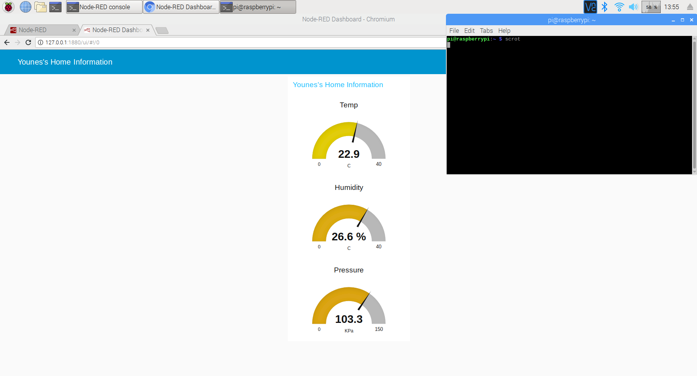

# IoT Home Application

A smart home monitoring system that tracks environmental parameters such as temperature, humidity, and pressure using IoT devices. This application enables seamless data collection, visualization, and remote management via cloud integration.

## Features
- **Real-time Monitoring**: Collect and display sensor data in real time.
- **Cloud Integration**: Utilize IBM Watson and Node-RED for data processing and visualization.
- **User-Friendly Dashboard**: Provides an intuitive interface for monitoring multiple devices.
- **Alerts and Notifications**: Configurable alerts for temperature thresholds and system errors.

## Technology Stack
- **Frontend**: Node-RED for dashboard creation.
- **Backend**: IBM Watson IoT for device management and data processing.
- **Hardware**: IoT sensors (DHT11 for temperature and humidity, BMP180 for pressure).
- **Protocols**: MQTT for communication between devices and cloud.

## Installation
1. **Clone the Repository**:
   ```bash
   git clone https://github.com/Younes-Alaoui-Ismaili/IoT-Home-Application.git
   cd IoT-Home-Application
### Node-RED Flow
Below is the Node-RED flow used to process data from the Sense HAT. It shows how temperature, humidity, and pressure are extracted and visualized on the dashboard.


### Dashboard Front-End
This dashboard provides real-time monitoring of environmental data like temperature, humidity, and pressure.


