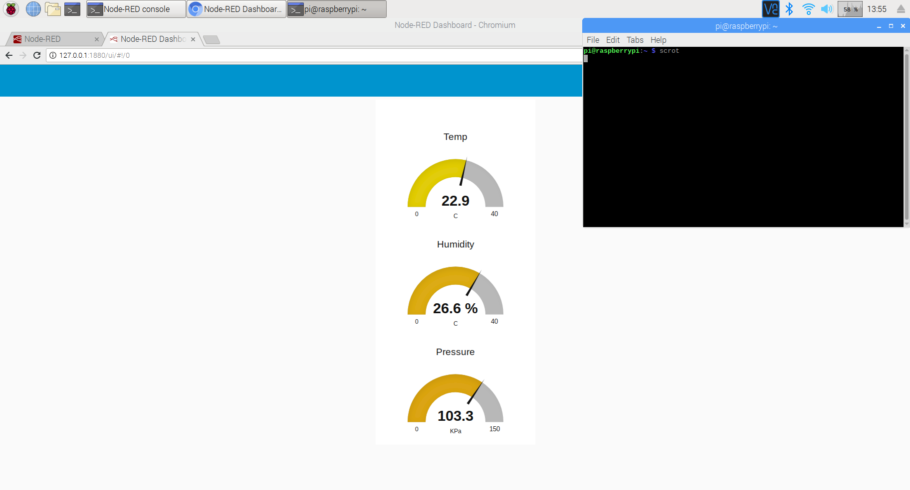

# HomeClimate, IoT Environmental Control with Node-RED

> Prototype 2019, capteurs environnementaux (DHT11, BMP180) + Node-RED + IBM Watson IoT.

---

## Pourquoi ce repo est ici

Projet exploratoire 2019, surveillance d'environnement domestique (température, humidité, pression) avec Node-RED et IBM Watson IoT.

**Statut** : archivé, non maintenu, conservé en vitrine.

---

## Ce que démontre ce projet

- Maîtrise des protocoles IoT (MQTT) et orchestration visuelle (Node-RED).
- Intégration cloud (IBM Watson IoT) pour visualisation temps réel.
- Conception de tableaux de bord opérationnels.

## Captures

### Flow Node-RED

### Dashboard

---

## Licence

MIT.
